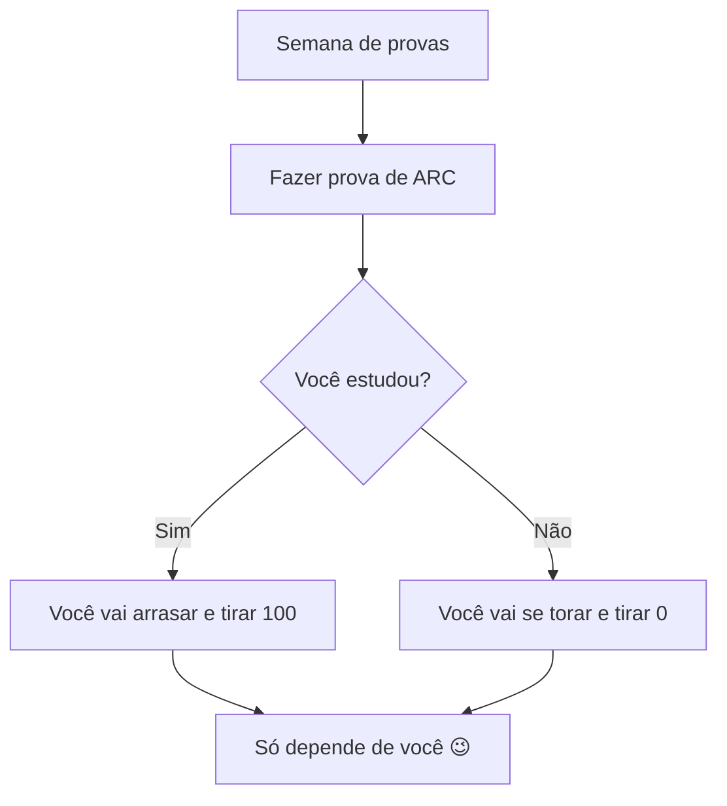

```mermaid 
flowchart TD
A[Semana de provas] --> B[Fazer prova de ARC]
B --> C{Você estudou?}
C --> |Sim| D[Você vai arrasar e tirar 100]
C --> |Não| E[Você vai se torar e tirar 0]
D --> F[Só depende de você 😉]
E --> F[Só depende de você 😉]


```